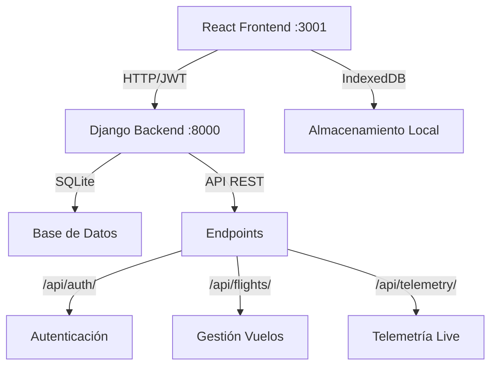

# 🚀 Astra CanSat Dashboard - Estación de Misión Caelus


## 📖 Descripción

**Sistema completo fullstack** de telemetría en tiempo real para el proyecto **CanSat Caelus** del equipo **Astra Rocketry**. Esta aplicación web proporciona una arquitectura moderna con **frontend React** y **backend Django REST API**, incluyendo autenticación JWT, base de datos persistente, y una interfaz completa para el monitoreo, análisis y visualización de datos de vuelo de satélites tipo CanSat.

### 🌟 **Características Principales del Sistema Completo**

- **🔐 Autenticación JWT**: Sistema completo de usuarios con roles y permisos
- **🐍 Backend Django**: API REST robusta con base de datos SQLite/PostgreSQL
- **⚛️ Frontend React**: Interfaz moderna e interactiva
- **📡 API REST**: Comunicación completa entre frontend y backend
- **💾 Persistencia**: Datos guardados en base de datos del servidor
- **🔄 Tiempo Real**: Telemetría en vivo con actualización automática
- **📊 Dashboard Completo**: Gráficas interactivas, mapas GPS, visualización 3D
- **🛡️ Seguridad**: Rutas protegidas, CORS configurado, validación de datos

## ✨ Características Principales

### 🎯 Dashboard en Tiempo Real
- **Modo Live**: Monitoreo en tiempo real con simulación de telemetría
- **Panel de Estado**: Visualización del estado del CanSat (batería, canal walkie, última actualización)
- **Control de Misión**: Tiempo de vuelo, velocidades vertical/horizontal, distancia recorrida
- **Sistema de Alertas**: Notificaciones automáticas para fallos de sensores, batería baja y pérdida de GPS

### 📊 Visualización de Datos
- **Gráficas Interactivas**: Temperatura, humedad, altitud, presión y canal walkie
- **Mapa GPS**: Visualización de trayectoria en tiempo real con marcadores
- **Visor 3D**: Representación tridimensional con datos del giroscopio
- **Animaciones Fluidas**: Interfaz responsiva con Framer Motion

### 💾 Gestión de Datos
- **Base de Datos Local**: Almacenamiento persistente con IndexedDB
- **Importación de Archivos**: Carga de datos desde archivos TXT/CSV
- **Exportación Completa**: Paquetes ZIP con datos, gráficas y metadatos
- **Historial de Vuelos**: Gestión y selección de vuelos guardados

### 🛠️ Funcionalidades Avanzadas
- **Sistema de Administración**: Control de acceso con autenticación y rutas protegidas
- **Editor Visual Inline**: Sistema de edición en tiempo real del código React
- **Modelo 3D Personalizable**: Carga de modelos OBJ para visualización
- **Cálculos Automáticos**: Velocidades, distancias y análisis de trayectoria
- **Interfaz Responsive**: Diseño adaptativo con Tailwind CSS
- **Gestión de Usuarios**: Sistema de roles y permisos diferenciados

## 🏗️ Arquitectura del Proyecto

### 🌐 Arquitectura Fullstack

Este proyecto utiliza una arquitectura moderna de **Frontend React + Backend Django** con autenticación JWT y APIs REST.

```
astra-cansat-dashboard/
├── 📁 backend/               # 🐍 Backend Django REST API
│   ├── 📁 astra_backend/        # Configuración principal Django
│   │   ├── ⚙️ settings.py       # Configuraciones, CORS, JWT
│   │   ├── 🌐 urls.py           # URLs principales
│   │   └── 🔧 wsgi.py           # Servidor WSGI
│   ├── 📁 accounts/             # 👥 App de usuarios y autenticación
│   │   ├── 👤 models.py         # Modelo CustomUser extendido
│   │   ├── 🔐 views.py          # Login/logout JWT
│   │   ├── 📡 serializers.py    # Serialización de datos
│   │   └── 🌐 urls.py           # Endpoints de auth
│   ├── 📁 flights/              # ✈️ App de gestión de vuelos
│   │   ├── ✈️ models.py         # Modelos Flight, FlightData
│   │   ├── 📊 views.py          # CRUD vuelos y datos
│   │   ├── 📡 serializers.py    # Serialización flight data
│   │   └── � urls.py           # Endpoints de vuelos
│   ├── 📁 telemetry/            # 📡 App de telemetría en tiempo real
│   │   ├── 📊 models.py         # Modelo TelemetryData
│   │   ├── 📈 views.py          # API telemetría live
│   │   ├── 📡 serializers.py    # Serialización telemetría
│   │   └── 🌐 urls.py           # Endpoints telemetría
│   ├── �️ db.sqlite3           # Base de datos SQLite
│   ├── 📋 requirements.txt     # Dependencias Python
│   ├── 🚀 manage.py            # Django management
│   ├── 📊 create_sample_data.py # Script de datos de prueba
│   └── 📖 README.md            # Documentación backend
├── 📁 src/                   # ⚛️ Frontend React
│   ├── 📄 App.jsx              # Componente principal
│   ├── 🎨 index.css            # Estilos globales y variables CSS
│   ├── 📄 main.jsx             # Punto de entrada con routing
│   ├── 📁 components/          # Componentes React
│   │   ├── 📊 ChartsGrid.jsx       # Grilla de gráficas
│   │   ├── � TelemetryDashboard.jsx # Dashboard telemetría en tiempo real
│   │   ├── 🗃️ FlightSelector*.jsx  # Selectores de vuelos
│   │   ├── 🌐 MapSection.jsx       # Mapa GPS
│   │   ├── 🎯 GyroscopeViewer.jsx  # Visor 3D
│   │   ├── 🎛️ MissionControl.jsx   # Control de misión
│   │   ├── 📈 StatusPanel.jsx      # Panel de estado
│   │   ├── 📁 auth/                # 🔐 Autenticación
│   │   │   ├── 🔐 LoginForm.jsx        # Form login con backend
│   │   │   ├── 🛡️ ProtectedRoute.jsx   # Rutas protegidas JWT
│   │   │   └── 👑 AdminLayout.jsx      # Layout administración
│   │   └── 📁 ui/                  # Componentes UI base
│   ├── 📁 contexts/            # Contextos React
│   │   └── 🔐 AuthContext.jsx      # Auth con Django backend
│   ├── 📁 hooks/               # Custom Hooks
│   │   └── 🌐 useApi.js            # Hook para llamadas API
│   ├── 📁 pages/               # Páginas principales
│   │   ├── 🌍 PublicDashboard.jsx   # Dashboard público
│   │   └── 👑 AdminDashboard.jsx    # Dashboard administración
│   ├── 📁 lib/                 # Librerías y utilidades
│   │   └── 💾 db.js                # Gestión IndexedDB local
│   └── 📁 utils/               # Utilidades
│       ├── 🧮 calculations.js      # Cálculos de vuelo
│       └── 📊 mockData.js          # Datos de prueba
├── 📁 public/                # Recursos estáticos
│   ├── 🎨 logo.png             # Logo Astra Rocketry
│   └── 🎯 cansat.obj           # Modelo 3D CanSat
├── 📁 plugins/               # Plugins Vite personalizados
│   └── 📁 visual-editor/       # Sistema edición visual
└── 📁 tools/                 # Herramientas desarrollo
    └── 🤖 generate-llms.js     # Generador datos LLMs
```

### 🔄 Flujo de Datos



## 🚀 Instalación y Configuración

### 📋 Prerrequisitos
- **Node.js** >= 18.x
- **npm** >= 9.x  
- **Python** >= 3.8
- **pip** (gestor de paquetes Python)
- Navegador moderno con soporte para ES6+

### ⚡ Instalación Completa (Frontend + Backend)

#### 1️⃣ **Clonar el Repositorio**
```bash
git clone https://github.com/YIJ18/PLANTILLA.git
cd PLANTILLA
```

#### 2️⃣ **Configurar Frontend React**
```bash
# Instalar dependencias del frontend
npm install
```

#### 3️⃣ **Configurar Backend Django**
```bash
# Navegar al directorio backend
cd backend

# Crear entorno virtual (recomendado)
python -m venv venv
# Windows:
venv\Scripts\activate
# Linux/Mac:
source venv/bin/activate

# Instalar dependencias Python
pip install -r requirements.txt

# Ejecutar migraciones de base de datos
python manage.py migrate

# Crear datos de prueba y usuarios
python create_sample_data.py
```

#### 4️⃣ **Ejecutar la Aplicación**

**Opción A: Ejecutar ambos servidores manualmente**
```bash
# Terminal 1 - Backend Django (Puerto 8000)
cd backend
python manage.py runserver

# Terminal 2 - Frontend React (Puerto 3001)
cd ..
npm run dev
```

**Opción B: Script automatizado (próximamente)**
```bash
npm run fullstack
```

#### 5️⃣ **Acceder a la Aplicación**
- **Frontend**: http://localhost:3001
- **Backend API**: http://localhost:8000
- **Admin Django**: http://localhost:8000/admin

### 🔐 Credenciales de Acceso

**Usuarios de la Aplicación (Frontend):**
| Usuario | Contraseña | Rol |
|---------|------------|-----|
| `admin@astra.com` | `admin123` | Administrador |
| `operator@astra.com` | `operator123` | Operador |
| `analyst@astra.com` | `analyst123` | Analista |

**Panel de Administración Django (Backend):**
| Usuario | Contraseña | Tipo |
|---------|------------|------|
| `admin` | `admin123` | Superusuario |

### 🔧 Scripts Disponibles

**Frontend (React):**
```bash
# Desarrollo con hot reload
npm run dev

# Compilar para producción
npm run build

# Previsualizar build de producción  
npm run preview
```

**Backend (Django):**
```bash
cd backend

# Ejecutar servidor de desarrollo
python manage.py runserver

# Ejecutar con puerto específico
python manage.py runserver 8080

# Crear migraciones
python manage.py makemigrations

# Aplicar migraciones
python manage.py migrate

# Crear superusuario
python manage.py createsuperuser

# Recrear datos de prueba
python create_sample_data.py

# Verificar usuarios existentes
python check_users.py
```

### 🌐 URLs y Endpoints

**Frontend:**
- Dashboard Público: `http://localhost:3001/`
- Panel Admin: `http://localhost:3001/admin`
- Login: `http://localhost:3001/login`

**Backend API:**
- API Root: `http://localhost:8000/api/`
- Autenticación: `http://localhost:8000/api/auth/`
- Vuelos: `http://localhost:8000/api/flights/`
- Telemetría: `http://localhost:8000/api/telemetry/`
- Admin Panel: `http://localhost:8000/admin/`

### ⚙️ Configuración Adicional

#### 🔥 Variables de Entorno
Crea un archivo `.env` en la carpeta `backend/`:
```env
DEBUG=True
SECRET_KEY=tu-clave-secreta-aqui
ALLOWED_HOSTS=localhost,127.0.0.1
CORS_ALLOWED_ORIGINS=http://localhost:3001,http://127.0.0.1:3001
```

#### 🐳 Docker (Opcional)
```bash
# Próximamente: contenedores Docker
docker-compose up -d
```

### 🔄 Desarrollo Colaborativo

**Para otros desarrolladores:**
```bash
# 1. Clonar repositorio
git clone https://github.com/YIJ18/PLANTILLA.git
cd PLANTILLA

# 2. Instalar frontend
npm install

# 3. Configurar backend
cd backend
python -m venv venv
venv\Scripts\activate  # Windows
pip install -r requirements.txt
python manage.py migrate
python create_sample_data.py

# 4. Ejecutar en desarrollo
# Terminal 1:
cd backend && python manage.py runserver
# Terminal 2: 
npm run dev
```

## 📱 Uso del Dashboard

### � Vista Pública (/)
La vista pública permite visualizar datos de vuelos sin capacidades de gestión:

- **Solo Lectura**: Visualización de vuelos guardados
- **Sin Gestión**: No permite cargar archivos ni modo live
- **Acceso Libre**: No requiere autenticación
- **Botón Admin**: Acceso directo al login de administración

### 👑 Panel de Administración (/admin)

#### 🔐 Acceso de Administrador
Para acceder al panel completo, usa estas credenciales de demo:

| Usuario | Contraseña | Rol |
|---------|------------|-----|
| `admin` | `astra2024` | Administrador Astra |
| `mission-control` | `caelus2024` | Control de Misión |

#### �🎮 Funcionalidades Completas

**Modo en Vivo:**
1. Haz clic en **"Iniciar Modo Live"**
2. Introduce un nombre para el vuelo
3. Los datos se actualizarán automáticamente cada 2 segundos
4. Usa **"Detener Live"** para pausar la telemetría

**Importar Datos:**
1. Haz clic en **"Cargar Archivo"**
2. Selecciona un archivo TXT/CSV con el formato requerido
3. Los datos se parsearán y visualizarán automáticamente

**Gestión de Vuelos:**
- **Seleccionar Vuelo**: Usa el dropdown para cargar vuelos guardados
- **Eliminar Vuelos**: Botón de eliminación en cada vuelo guardado
- **Exportar**: Genera un paquete ZIP completo con datos y gráficas
- **Historial**: Todos los vuelos se guardan automáticamente en IndexedDB

### 🔄 Navegación entre Modos
- **Vista Pública → Admin**: Botón "Acceso Admin" en el selector de vuelos
- **Admin → Vista Pública**: Botón "Vista Pública" en el header de admin
- **Cerrar Sesión**: Botón "Cerrar Sesión" regresa a la vista pública

### 🗺️ Formato de Datos

```csv
timestamp,temp,humidity,alt,pressure,walkie,acc_x,acc_y,acc_z,gyro_x,gyro_y,gyro_z,lat,lng
1635724800000,25.5,65.2,120.5,1001.2,8,0.1,-0.2,9.8,12.5,-3.4,45.2,40.7128,-74.0060
```

## 🎯 Componentes Principales

### 📊 ChartsGrid
- Gráficas interactivas con Chart.js
- Visualización de temperatura, humedad, altitud, presión
- Actualización en tiempo real

### 🗺️ MapSection
- Mapa interactivo con React Leaflet
- Marcadores de posición GPS
- Visualización de trayectoria completa

### 🎯 GyroscopeViewer
- Renderizado 3D con Three.js y React Three Fiber
- Carga de modelos OBJ personalizados
- Rotación basada en datos del giroscopio

### 🎛️ MissionControl
- Panel de control de misión
- Checklist automático de sistemas
- Log de eventos en tiempo real

## 🛠️ Tecnologías Utilizadas

### ⚛️ Frontend (React)
- **React 18** - Framework principal
- **Vite 4** - Build tool y dev server
- **React Router DOM** - Routing y navegación
- **Tailwind CSS** - Framework de estilos
- **Framer Motion** - Animaciones
- **Radix UI** - Componentes base accesibles

### � Backend (Django)
- **Django 4.2.7** - Framework web principal
- **Django REST Framework** - API REST
- **djangorestframework-simplejwt** - Autenticación JWT
- **django-cors-headers** - Gestión CORS
- **SQLite** - Base de datos (desarrollo)
- **Python 3.8+** - Lenguaje backend

### �🔐 Autenticación y Seguridad
- **JWT (JSON Web Tokens)** - Autenticación stateless
- **Django Authentication** - Sistema de usuarios
- **CORS** - Cross-Origin Resource Sharing
- **Context API** - Gestión estado frontend
- **localStorage** - Persistencia de tokens
- **Protected Routes** - Rutas protegidas por rol

### 📊 Visualización
- **Chart.js + React-ChartJS-2** - Gráficas interactivas
- **React Leaflet** - Mapas
- **Three.js + React Three Fiber** - Renderizado 3D
- **React Three Drei** - Utilidades 3D

### 💾 Gestión de Datos
- **Django ORM** - Object-Relational Mapping
- **SQLite** - Base de datos local (desarrollo)
- **IndexedDB** - Almacenamiento local frontend
- **JSZip** - Exportación de archivos
- **HTML2Canvas** - Captura de gráficas
- **File-Saver** - Descarga de archivos

### 🌐 API y Comunicación
- **Fetch API** - Llamadas HTTP
- **Axios** (opcional) - Cliente HTTP
- **Django REST Serializers** - Serialización de datos
- **JSON** - Formato de intercambio
- **RESTful API** - Arquitectura de servicios

### 🔧 Herramientas de Desarrollo
- **ESLint** - Linting JavaScript
- **PostCSS + Autoprefixer** - Procesamiento CSS
- **Babel** - Transpilación editor visual
- **Django Management Commands** - Scripts de gestión
- **pip** - Gestor paquetes Python
- **npm** - Gestor paquetes Node.js

## ⚙️ Configuración Avanzada

### 🎨 Personalización de Estilos
Los estilos utilizan variables CSS customizables en `src/index.css`:

```css
:root {
  --background: 222.2 84% 4.9%;
  --foreground: 210 40% 98%;
  --primary: 217.2 91.2% 59.8%;
  /* ... más variables */
}
```

### 🛠️ Plugin de Editor Visual
El proyecto incluye un sistema de edición visual que permite:
- Edición inline de elementos React
- Transformación automática de JSX
- API de aplicación de cambios en tiempo real

### 🌐 Configuración de Red
Para desarrollo en red local, modifica `vite.config.js`:

```javascript
server: {
  host: '0.0.0.0', // Permitir conexiones externas
  port: 3000,
  cors: true
}
```

## � Sistema de Administración

### 👥 Roles y Permisos

**Vista Pública (`/`)**
- ✅ Visualización de vuelos guardados
- ✅ Acceso a gráficas y mapas
- ✅ Visor 3D (solo lectura)
- ❌ Gestión de archivos
- ❌ Modo en vivo
- ❌ Exportación de datos

**Administrador (`/admin`)**
- ✅ Todas las funciones públicas
- ✅ Carga de archivos de telemetría
- ✅ Modo de monitoreo en vivo
- ✅ Eliminación de vuelos
- ✅ Exportación completa
- ✅ Grabación de videos 3D
- ✅ Carga de modelos 3D personalizados

### 🛡️ Seguridad
- **Autenticación Local**: Sistema de login con credenciales predefinidas
- **Persistencia de Sesión**: Las sesiones se mantienen en localStorage
- **Rutas Protegidas**: Acceso controlado a funcionalidades administrativas
- **Validación de Roles**: Verificación de permisos en tiempo real
- **Timeout de Sesión**: (Implementable según necesidades)

### 🔧 Configuración de Usuarios
Actualmente usa usuarios predefinidos en `AuthContext.jsx`:
```javascript
const DEMO_USERS = [
  {
    username: 'admin',
    password: 'astra2024',
    name: 'Administrador Astra',
    role: 'admin'
  },
  // ... más usuarios
];
```

## 🔍 Cálculos y Algoritmos

### 📏 Cálculo de Distancias
Utiliza la fórmula de Haversine para calcular distancias entre coordenadas GPS:

```javascript
function getDistance(lat1, lon1, lat2, lon2) {
  const R = 6371e3; // Radio de la Tierra en metros
  const φ1 = lat1 * Math.PI/180;
  const φ2 = lat2 * Math.PI/180;
  // ... implementación completa
}
```

### 📊 Análisis de Velocidades
- **Velocidad Vertical**: Cambio de altitud / tiempo
- **Velocidad Horizontal**: Distancia GPS / tiempo
- **Distancia Total**: Suma acumulativa de segmentos

## 🌐 API Backend (Django REST)

### 🔗 Endpoints Principales

#### 🔐 Autenticación (`/api/auth/`)
```http
POST /api/auth/login/
Content-Type: application/json

{
  "email": "admin@astra.com",
  "password": "admin123"
}

# Respuesta:
{
  "access": "jwt_token_here",
  "refresh": "refresh_token_here",
  "user": {
    "id": 1,
    "email": "admin@astra.com",
    "first_name": "Admin",
    "role": "admin"
  }
}
```

```http
POST /api/auth/logout/
Authorization: Bearer jwt_token_here
```

#### ✈️ Gestión de Vuelos (`/api/flights/`)
```http
# Listar vuelos
GET /api/flights/
Authorization: Bearer jwt_token_here

# Crear vuelo
POST /api/flights/
Content-Type: application/json
Authorization: Bearer jwt_token_here

{
  "name": "Vuelo Test 001",
  "description": "Vuelo de prueba",
  "status": "active"
}

# Obtener vuelo específico
GET /api/flights/{id}/
Authorization: Bearer jwt_token_here

# Datos de telemetría de un vuelo
GET /api/flights/{id}/data/
Authorization: Bearer jwt_token_here
```

#### 📡 Telemetría (`/api/telemetry/`)
```http
# Datos en tiempo real
GET /api/telemetry/
Authorization: Bearer jwt_token_here

# Enviar datos de telemetría
POST /api/telemetry/
Content-Type: application/json
Authorization: Bearer jwt_token_here

{
  "flight": 1,
  "timestamp": "2024-10-11T10:30:00Z",
  "temperature": 25.5,
  "humidity": 65.2,
  "altitude": 120.5,
  "pressure": 1001.2,
  "walkie_channel": 8,
  "acceleration_x": 0.1,
  "acceleration_y": -0.2,
  "acceleration_z": 9.8,
  "gyroscope_x": 12.5,
  "gyroscope_y": -3.4,
  "gyroscope_z": 45.2,
  "latitude": 40.7128,
  "longitude": -74.0060
}
```

### 🔑 Autenticación JWT

El sistema utiliza **JSON Web Tokens** para autenticación:

1. **Login**: Envía credenciales → Recibe tokens
2. **Requests**: Incluye token en header `Authorization: Bearer <token>`
3. **Refresh**: Usa refresh token para obtener nuevo access token
4. **Logout**: Invalida tokens del lado del servidor

### 📊 Modelos de Datos

**Usuario (CustomUser):**
```python
{
  "id": Integer,
  "email": String (único),
  "first_name": String,
  "last_name": String,
  "role": String ["admin", "operator", "analyst"],
  "is_active": Boolean,
  "date_joined": DateTime
}
```

**Vuelo (Flight):**
```python
{
  "id": Integer,
  "name": String,
  "description": Text,
  "created_by": Integer (User ID),
  "created_at": DateTime,
  "status": String ["active", "completed", "archived"]
}
```

**Datos de Vuelo (FlightData):**
```python
{
  "id": Integer,
  "flight": Integer (Flight ID),
  "timestamp": DateTime,
  "temperature": Float,
  "humidity": Float,
  "altitude": Float,
  "pressure": Float,
  "walkie_channel": Integer,
  "acceleration_x": Float,
  "acceleration_y": Float,
  "acceleration_z": Float,
  "gyroscope_x": Float,
  "gyroscope_y": Float,
  "gyroscope_z": Float,
  "latitude": Float,
  "longitude": Float
}
```

### 🛡️ Seguridad API

- **Autenticación requerida**: Todos los endpoints requieren JWT válido
- **CORS configurado**: Permitido desde frontend (localhost:3001)
- **Validación de datos**: Serializers validan entrada
- **Filtrado por usuario**: Usuarios solo ven sus propios datos
- **Roles y permisos**: Control basado en rol de usuario

## 🚨 Sistema de Alertas

El dashboard incluye un sistema inteligente de alertas:

- **🔋 Batería Crítica**: Alerta cuando < 20%
- **🌡️ Sensor de Temperatura**: Detecta fallos (valor 0)
- **📡 Pérdida de GPS**: Sin actualización por 10+ segundos
- **📻 Canal Walkie**: Monitoreo de frecuencia

## 📦 Exportación de Datos

### 📋 Contenido del Paquete ZIP
- `metadata.json` - Información del vuelo
- `{nombre}_data.txt` - Datos en formato CSV
- `grafica_*.png` - Capturas de todas las gráficas
- `mapa_*.png` - Captura del mapa
- `status_*.png` - Panel de estado
- `astra_logo.png` - Logo del equipo

## 🐛 Troubleshooting

### ❌ Problemas Comunes Frontend

**Error de instalación de dependencias:**
```bash
# Limpiar caché de npm
npm cache clean --force
rm -rf node_modules package-lock.json
npm install
```

**Problemas con el servidor de desarrollo:**
```bash
# Verificar puerto disponible
netstat -ano | findstr :3001
# Cambiar puerto en package.json si es necesario
```

**Errores de memoria en build:**
```bash
# Aumentar memoria para Node.js
NODE_OPTIONS="--max-old-space-size=4096" npm run build
```

### ❌ Problemas Comunes Backend

**Error "ModuleNotFoundError":**
```bash
# Activar entorno virtual
cd backend
venv\Scripts\activate  # Windows
source venv/bin/activate  # Linux/Mac

# Reinstalar dependencias
pip install -r requirements.txt
```

**Error de base de datos:**
```bash
# Eliminar base de datos y recrear
cd backend
rm db.sqlite3
python manage.py migrate
python create_sample_data.py
```

**Puerto 8000 ocupado:**
```bash
# Usar puerto diferente
python manage.py runserver 8080
# Actualizar frontend para usar nuevo puerto
```

**Errores CORS:**
```bash
# Verificar configuración en settings.py
CORS_ALLOWED_ORIGINS = [
    "http://localhost:3001",
    "http://127.0.0.1:3001",
]
```

**Error de migraciones:**
```bash
# Resetear migraciones (CUIDADO: elimina datos)
cd backend
rm -rf */migrations/0*.py
python manage.py makemigrations
python manage.py migrate
```

### 🔧 Logs y Debugging

**Frontend (React):**
```bash
# Consola del navegador (F12)
# Logs de AuthContext y API calls
```

**Backend (Django):**
```bash
# Ver logs del servidor
python manage.py runserver --verbosity=2

# Debug mode en settings.py
DEBUG = True
```

### 🌐 Problemas de Conectividad

**Frontend no se conecta al backend:**
1. Verificar que Django esté ejecutándose en puerto 8000
2. Verificar CORS en `settings.py`
3. Verificar URL del API en frontend (`AuthContext.jsx`)
4. Comprobar que no hay firewall bloqueando

**Autenticación fallando:**
1. Verificar credenciales en `create_sample_data.py`
2. Comprobar que JWT está configurado correctamente
3. Verificar que tokens no han expirado
4. Limpiar localStorage del navegador

### 📱 Problemas Móviles/Red

**Acceso desde otros dispositivos:**
```bash
# Frontend - permitir conexiones externas
npm run dev -- --host 0.0.0.0

# Backend - configurar ALLOWED_HOSTS
ALLOWED_HOSTS = ['*']  # Solo para desarrollo
```

**Base de datos en producción:**
```bash
# Cambiar a PostgreSQL/MySQL en producción
pip install psycopg2-binary  # PostgreSQL
# Actualizar DATABASES en settings.py
```

## 🤝 Contribución

### 📝 Flujo de Contribución
1. Fork del repositorio
2. Crear rama feature: `git checkout -b feature/nueva-funcionalidad`
3. Commit cambios: `git commit -m 'Añadir nueva funcionalidad'`
4. Push a la rama: `git push origin feature/nueva-funcionalidad`
5. Crear Pull Request

### 📏 Estándares de Código
- Usar ESLint para consistencia
- Comentarios en español para el equipo
- Componentes funcionales con hooks
- Props tipadas cuando sea posible

## 📄 Licencia

Este proyecto está bajo la Licencia MIT. Ver archivo `LICENSE` para más detalles.

## 👥 Equipo Astra Rocketry

**Misión Caelus - Universidad Iberoamericana**

- 🚀 Desarrollo de CanSat
- 📡 Sistemas de Telemetría  
- 💻 Dashboard de Monitoreo
- 🎯 Análisis de Datos de Vuelo

---

### 📞 Contacto

Para dudas técnicas o colaboración, contacta al equipo de desarrollo.

**¡Vuela alto con Astra Rocketry! 🚀**
